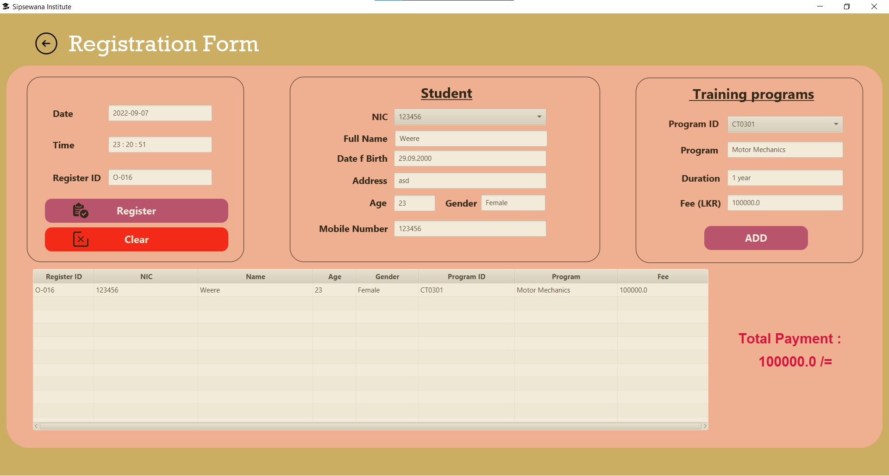

#Sipsewana Institute(Hibernate-Final) 

Hibernate is used as ORM Tool in this project.

*Layered Architecture 
*Hibernate Framework(ORM Tool) 
*Java 
*javaFx 
*MySQL 

<b>#Login </b>
 
<b>#DashBoard <b>
 
<b>#StudentForm <b>
 
<b>#StudentDeatils <b>
 
<b>#ProgramForm <b>
 
<b>#ProgramDetails <b>
 
<b>#RegisterForm <b>
 
<b>#RegisterDetails </b>

